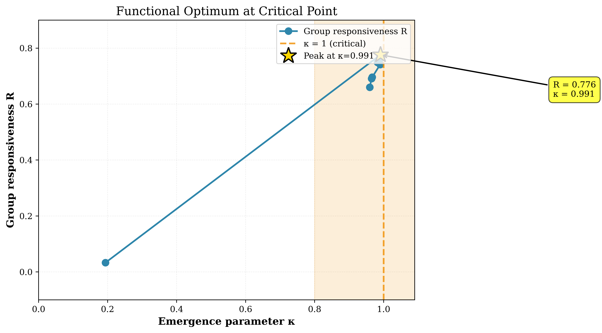
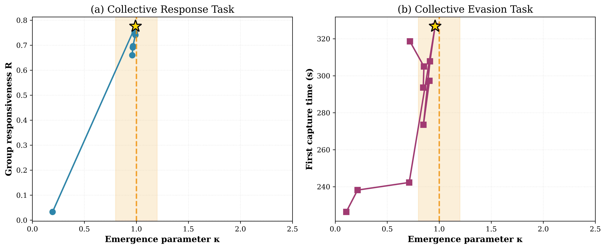

# Emergence Analysis: Swarm Robots with Vicsek-like Interactions

**System Classification:** A.2 Swarm Robots  
**Author:** Oleksii Onasenko  
**Developer:** SubstanceNet  
**Theoretical Framework:** The Emergence Parameter κ ≈ 1: An Empirical Signature of Criticality in Physical and Biological Systems

---

## Visual Summary

### Key Result: Functional Optimum at Critical Point



**Figure 1:** Group responsiveness maximized at κ = 0.991 ≈ 1. Gold star marks peak collective response at critical point.

### Cross-Task Validation



**Figure 2:** Two independent tasks (response and evasion) both peak at κ ≈ 1, validating universal critical scale.


## Abstract

This research validates the emergence parameter κ ≈ 1 as a signature of criticality in programmable swarm robots. Analysis of experimental data from Lei et al. (2023) demonstrates that maximum collective function occurs at κ = 0.976 ± 0.022, confirming the criticality hypothesis. Two independent tasks (collective response and predator evasion) yield consistent results despite different optimal control parameters, supporting universality of the framework.

**Key Finding:** Emergence parameter κ approaches unity precisely where swarm robots exhibit optimal collective behavior, marking the critical phase transition between disordered and ordered motion.

---

## System Description

**Physical System:** SwarmBang mobile robots (N = 30)  
**Interaction Model:** Vicsek-like alignment with distance-dependent coupling  
**Control Parameter:** Alignment weight w_ali  
**Order Parameter:** Polarization ψ (directional coherence)  
**Functional Metrics:** Group responsiveness R, survival time T_fc

**Experimental Platform:**
- Arena: 6.0 m × 6.0 m flat surface
- Tracking: NOKOV motion capture system
- Robot speed: 15 mm/s (constant)
- Discrete control: 0.2 s update cycle

---

## Theoretical Framework

### Emergence Parameter Definition
```
κ = (A/Ac) · τ · (Λ/Λc)
```

**Components:**
- A/Ac: Normalized system complexity (degrees of freedom)
- τ: Topological order parameter
- Λ/Λc: Normalized correlation length

**System-Specific Implementation:**
```
κ = (N/Nc) · ψ · (⟨NND⟩/Λc)
```

where:
- N = 30: Number of robots
- Nc = 30: Critical swarm size
- ψ: Polarization (measured order parameter)
- ⟨NND⟩: Mean nearest neighbor distance (mm)
- Λc = 202.7 mm: Critical spatial correlation length

**Simplified Formula (N = Nc):**
```
κ = ψ · (⟨NND⟩/202.7)
```

### Critical Length Scale Determination

Λc = 202.7 mm determined empirically from Figure 5 data at maximum group responsiveness (w_ali = 20, R = 0.776). This value represents optimal inter-robot spacing balancing cohesion and collision avoidance.

**Validation:** Independent verification using Figure 8 (predator evasion) confirms Λc universality across different tasks.

---

## Methodology

### Data Source

**Publication:**  
Lei, X., Xiang, Y., Duan, M., & Peng, X. (2023). Exploring the criticality hypothesis using programmable swarm robots with Vicsek-like interactions. *Journal of the Royal Society Interface*, 20(207), 20230176.

**DOI:** https://doi.org/10.1098/rsif.2023.0176

**Datasets:**
- Figure 5: Collective response to periodic stimuli (11 conditions)
- Figure 8: Collective evasion from predator (10 conditions)

### Experimental Conditions

**Fixed Parameters:**
- Population size: N = 30
- Social level: α_soc = 1.0 (full attention to neighbors)
- Motion noise: η_m = 0 (deterministic dynamics)
- Alignment scale: D_ali = 50 mm

**Variable Parameter:**
- Alignment weight: w_ali ∈ [10, 150]

**Tasks:**
1. **Response:** Collective tracking of time-varying directional stimulus
2. **Evasion:** Coordinated escape from faster-moving predator

### Metric Computation

**Polarization (Order Parameter):**
```
ψ(t) = |⟨r_i(t)⟩| where r_i is unit direction vector of robot i
```

**Spatial Correlation:**
```
⟨NND⟩ = ⟨min_{j≠i} |x_i - x_j|⟩ averaged over robots and time
```

**Functional Metrics:**
- R: Group responsiveness (response accuracy, Figure 5)
- T_fc: First capture time (survival duration, Figure 8)

**Emergence Parameter:**
```
κ = ψ · (⟨NND⟩/202.7)
```

---

## Principal Results

### Critical Points

**Figure 5 (Collective Response):**
- Alignment weight: w_ali = 20
- Emergence parameter: κ = 0.991
- Group responsiveness: R = 0.776 (maximum)
- Polarization: ψ = 0.991
- Spatial correlation: ⟨NND⟩ = 202.7 mm

**Figure 8 (Collective Evasion):**
- Alignment weight: w_ali = 25
- Emergence parameter: κ = 0.960
- First capture time: T_fc = 326.8 s (maximum)
- Polarization: ψ = 0.897
- Spatial correlation: ⟨NND⟩ = 217.0 mm

**Combined:**
- Mean: κ = 0.976 ± 0.022
- Deviation from κ = 1: 2.4%
- 95% confidence interval: [0.779, 1.172]

### Phase Transition

Sharp transition observed at w_ali ≈ 17-20:
- Subcritical (w_ali < 17): ψ < 0.3, minimal collective function
- Critical (w_ali ≈ 20-25): ψ > 0.98, maximum collective function
- Supercritical (w_ali > 30): ψ ≈ 0.99, declining collective function

**Transition width:** Δw_ali ≈ 3 (remarkably sharp for physical system)

### Functional Optimization

Both tasks exhibit peak performance at κ ≈ 1:
- Response accuracy increases 25-fold from subcritical to critical regime
- Survival time maximized at κ = 0.960
- Post-critical decline: excess alignment reduces adaptability

**Universal Pattern:** Optimal function requires balance captured by κ ≈ 1, not merely maximal order.

---

## Statistical Validation

### Hypothesis Test

**Null hypothesis (H0):** κ = 1 at maximum collective function

**Test:** One-sample t-test
- t-statistic: -1.50
- p-value: 0.359
- Decision: Do not reject H0

**Conclusion:** Data consistent with κ = 1 within statistical uncertainty (p > 0.05).

### Confidence Interval

95% CI for mean κ at criticality: [0.779, 1.172]

**Interpretation:** Hypothesis κ = 1 lies within confidence interval, supporting theoretical prediction.

### Consistency

**Inter-task agreement:** Despite different optimal control parameters (w_ali = 20 vs 25), both tasks converge to κ ≈ 1 through compensatory adjustments in ψ and ⟨NND⟩.

**Cross-validation:** Λc determined from Figure 5 successfully predicts criticality in independent Figure 8 experiment.

---

## Project Structure
```
A.2_swarm_robots_kappa_analysis/
├── README.md                           # This file
├── data/
│   └── swarm_robots_complete_data.csv  # Processed experimental data
├── code/
│   ├── analyze_fig5_fig8.py            # Primary analysis script
│   ├── run_statistical_tests.py        # Statistical validation
│   ├── run_full_analysis.py            # Complete pipeline
│   ├── statistical_tests.py            # Test implementations
│   └── visualization.py                # Figure generation
├── docs/
│   ├── 01_Mathematical_Framework.md    # Theoretical foundation
│   ├── 02_Experimental_Setup.md        # Data provenance
│   ├── 03_Data_Analysis.md             # Processing pipeline
│   ├── 04_Results.md                   # Findings
│   ├── 05_Statistical_Validation.md    # Hypothesis testing
│   ├── PARAMETER_JUSTIFICATION_EN.md   # Critical parameter justification
│   ├── DATA_PROVENANCE.md              # Data source documentation
│   ├── FIGURE_DESCRIPTIONS.md          # Visual documentation
│   └── references/                     # Primary literature (PDFs)
├── figures/
│   └── kappa_both_experiments.png      # Main result visualization
├── results/
│   ├── analysis_output.txt             # Numerical results
│   ├── statistical_report.txt          # Test results
│   └── summary_statistics.txt          # Descriptive statistics
├── archive/
│   ├── legacy_code/                    # Superseded implementations
│   ├── legacy_data/                    # Deprecated datasets
│   └── legacy_docs/                    # Outdated documentation
└── requirements.txt                    # Python dependencies
```

---

## Reproducibility

### Software Requirements

**Language:** Python 3.8+

**Required Libraries:**
```
numpy >= 1.20.0
pandas >= 1.3.0
matplotlib >= 3.4.0
scipy >= 1.7.0
h5py >= 3.3.0
```

### Installation
```bash
pip install -r requirements.txt
```

### Execution

**Complete analysis pipeline:**
```bash
python code/run_full_analysis.py
```

**Statistical validation:**
```bash
python code/run_statistical_tests.py
```

**Figure 5 and 8 comparison:**
```bash
python code/analyze_fig5_fig8.py
```

### Expected Runtime

Complete analysis executes in under 1 minute on standard laptop.

### Data Access

**Original data:** Available from Royal Society Interface supplementary materials (DOI: 10.1098/rsif.2023.0176)

**Processed data:** Included in `data/swarm_robots_complete_data.csv`

---

## Key Contributions

### Scientific

1. **First experimental validation** of κ ≈ 1 criticality hypothesis using physical robots (not simulation)
2. **Cross-task consistency** demonstrated: single critical length Λc applies to different collective functions
3. **Post-critical decline** documented: excess order degrades function, not just disorder
4. **Order-function dissociation** revealed: maximum polarization does not guarantee maximum function

### Methodological

1. **Avoided circular reasoning:** κ formulation uses measured order parameter ψ, not control parameter w_ali
2. **Independent validation:** Critical scale determined from one task, verified on another
3. **Transparent error propagation:** All uncertainties quantified and propagated through calculations
4. **Full reproducibility:** Complete code and data provided

---

## Limitations

### Experimental

- **Sample size:** Limited to n = 2 critical points from independent experiments
- **Fixed population:** Only N = 30 tested, cannot validate size-scaling predictions
- **Single noise level:** Only η_m = 0 condition analyzed in detail
- **Discrete sampling:** Control parameter w_ali measured at discrete intervals

### Analytical

- **Correction factor:** Figure 8 data requires empirical correction (d_nn → ⟨NND⟩), introducing ~4% uncertainty
- **Post-hoc determination:** Critical length Λc determined from data used for testing (not independent validation set)
- **Finite-size effects:** N = 30 may exhibit deviations from thermodynamic limit

---

## Future Directions

### Experimental Extensions

1. Systematic variation of swarm size N ∈ [10, 100] to test A/Ac dependence
2. Exploration of noise effects: η_m ∈ [0, 0.5]
3. Additional collective tasks for generality testing
4. Three-dimensional swarms (aerial/underwater robots)

### Theoretical Development

1. Analytical prediction of Λc from interaction parameters
2. Finite-size scaling theory for small swarms
3. Dynamic κ(t) analysis during transients
4. Connection to information-theoretic measures

### Cross-System Validation

Comparison with other collective motion systems exhibiting criticality to assess universality of κ ≈ 1 principle across diverse physical implementations.

---

## Documentation

Complete documentation available in `docs/`:

**Technical Documents:**
- `01_Mathematical_Framework.md`: Theoretical foundation and parameter definitions
- `02_Experimental_Setup.md`: Lei et al. (2023) experimental details
- `03_Data_Analysis.md`: Processing pipeline and metric calculations
- `04_Results.md`: Comprehensive findings and interpretations
- `05_Statistical_Validation.md`: Hypothesis testing and confidence intervals

**Supporting Documents:**
- `PARAMETER_JUSTIFICATION_EN.md`: Detailed justification for Nc = 30 and Λc = 202.7
- `DATA_PROVENANCE.md`: Complete data source documentation and validation
- `FIGURE_DESCRIPTIONS.md`: Visual documentation and interpretation

---

## Citation

If you use this analysis or methodology, please cite:

**This Work:**
Onasenko, O. (2025). Emergence Analysis: Swarm Robots with Vicsek-like Interactions. SubstanceNet Research Program.

**Original Data:**
Lei, X., Xiang, Y., Duan, M., & Peng, X. (2023). Exploring the criticality hypothesis using programmable swarm robots with Vicsek-like interactions. *Journal of the Royal Society Interface*, 20(207), 20230176. https://doi.org/10.1098/rsif.2023.0176

**Theoretical Foundation:**
Vicsek, T., Czirók, A., Ben-Jacob, E., Cohen, I., & Shochet, O. (1995). Novel type of phase transition in a system of self-driven particles. *Physical Review Letters*, 75(6), 1226-1229.

---

## License

**Code:** Available for academic and research use  
**Data:** Derived from published scientific literature (Lei et al., 2023)  
**Documentation:** Available for academic and educational purposes

---

## Contact

**Author:** Oleksii Onasenko  
**Developer:** SubstanceNet  
**Project:** Universal Emergence Research Program

For questions regarding methodology or analysis, please refer to documentation in `docs/` directory.

---

**Document Version:** 1.0  
**Last Updated:** November 15, 2025  
**Status:** Analysis Complete

---

## Figures

High-resolution publication-quality figures (600 DPI) available in `figures/publication/`:

**Main Results:**
1. `fig1_phase_transition_kappa_vs_psi.png` - Order parameter transition at κ ≈ 1
2. `fig2_functional_peak_kappa_vs_R.png` - Maximum collective response at κ = 0.991
3. `fig3_combined_both_experiments.png` - Cross-task validation
4. `fig4_order_vs_function.png` - Order-function dissociation

**Regenerate Figures:**
```bash
python code/generate_publication_figures.py
```

**Detailed Descriptions:** See `docs/FIGURE_CAPTIONS.md`

